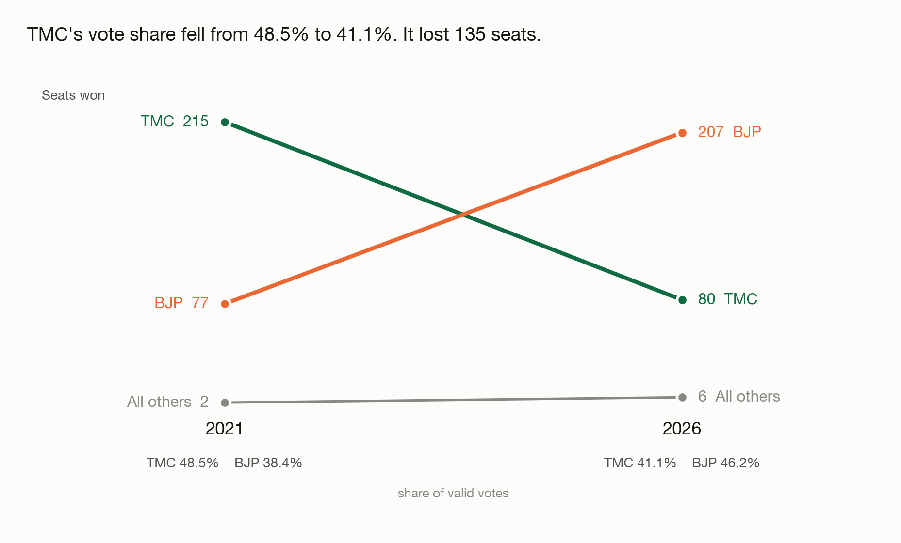
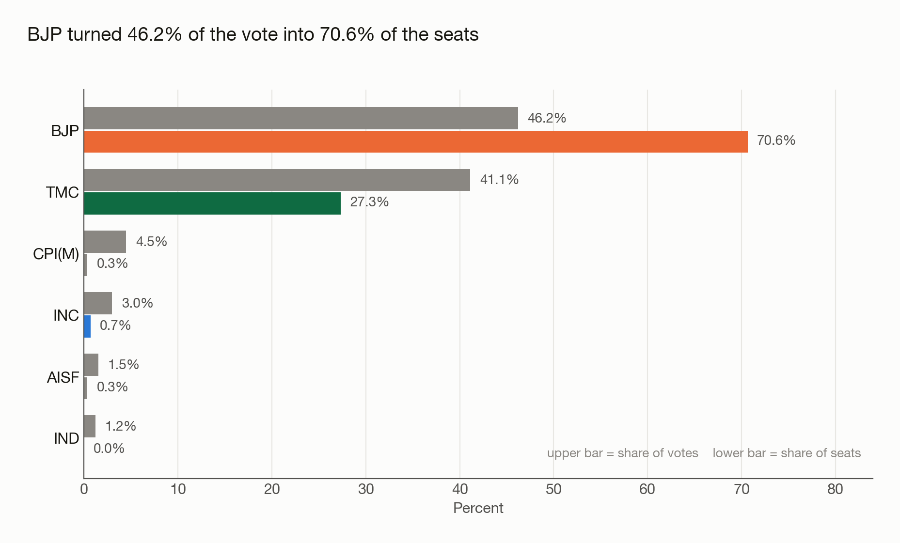
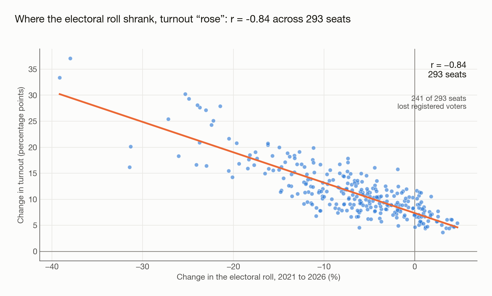

# West Bengal Assembly Elections: 2021 vs 2026

I pulled the Election Commission's statistical reports for both elections and
built a pipeline that goes from the raw workbooks to a queryable database, then
looked at what changed. 294 constituencies, 5,052 candidates, two elections.

Python and pandas for the cleaning, SQLite for the analysis.



## What I found

TMC went from 215 seats to 80. BJP went from 77 to 207.

The vote didn't move nearly as far as the seats did. TMC's share fell 7.4 points
and BJP's rose 7.8, so about 15 points changed hands between them — and that
produced a 135-seat swing. BJP ended up with 46% of the vote and 71% of the
seats. The reason is that 197 of the 294 seats in 2021 were held by margins
under 15 points, and a 7.4-point swing moves a margin by roughly fifteen. Most
of the state was already within reach before anyone voted.

Something I didn't expect: **not one seat moved against the tide.** 129 went
from TMC to BJP and none came back. In a state with 293 results I assumed a
handful would buck the trend. None did.



### The turnout number is misleading

This is the part I spent longest on.

Reported turnout was 93.6%, against 82.2% in 2021. That looked wrong to me, so I
checked the electorate, and it had *shrunk*, from about 73.2 million to 68.1
million. Registers don't lose 7% of their names in five years on their own.

Turnout is votes over registered voters, so a smaller register lifts the
percentage whether or not anyone extra turns up. Applying 2026's votes to the
2021 register gives 87.1% instead of 93.6%. Of the 11.4-point rise, 5.0 points
is more people voting and 6.5 points is the denominator. **57% of it is
arithmetic.**

The per-seat correlation between roll change and turnout change is −0.84 across
293 seats, and the register shrank in 241 of them.



What I can't tell you is *why* the register shrank. That needs a source I
haven't found, so I've left it as an open question rather than guessing.

| Party | 2021 vote | 2026 vote | 2021 seats | 2026 seats |
|---|---|---|---|---|
| TMC | 48.55% | 41.12% | 215 | 80 |
| BJP | 38.39% | 46.20% | 77 | 207 |
| CPI(M) | 4.78% | 4.49% | 0 | 1 |
| INC | 3.06% | 2.99% | 0 | 2 |
| NOTA | 1.10% | 0.78% | — | — |

Vote share here is a percentage of valid votes, NOTA excluded.

There's a slide deck walking through the same argument, attached to the
[latest release](../../releases/latest).

## Running it

```bash
pip install -r requirements.txt
python src/clean.py     # raw workbooks -> data/clean/
python src/load_db.py   # data/clean/  -> bengal_elections.db
```

If you'd rather not run anything, the prebuilt database and the deck are
attached to the [latest release](../../releases/latest). The seven CSVs under
`data/clean/` are committed either way, so you can read those directly.

`clean.py` asserts its own output against the totals the Commission publishes in
its Highlight report, and exits non-zero if anything drifts:

```
ok   electors, 293 polled seats           68,125,496
ok   valid votes                          63,258,138
ok   NOTA votes                              494,932
ok   contestants                               2,920
```

I added that after realising I had no way of knowing whether my parsing was
right. It caught two things on the first run, both of which turned out to be
properties of the source rather than my bugs: the Commission's elector total
excludes the one seat that didn't poll, and its "votes polled" figure includes
89,773 rejected votes that the detailed results don't itemise.

## What went wrong in the data

Nine problems, written up in [docs/data_quality.md](docs/data_quality.md). The
two that would have quietly produced wrong answers:

The 2021 party column contains `CPI(M)` on 139 rows and `CPIM` on 3. Same party.
Nothing errors, it just splits CPI(M) in two in any aggregation.

One candidate is named `Arup Roy, S/o Late Prabhat Roy`. The comma shifted his
row's columns, which pushed his party into the category field and made TMC's
2021 seat count read 214 instead of the correct 215. One character.

I also had the subtraction backwards in the regional swing query for a while, so
every region printed a TMC *gain* instead of a loss. Caught it before it went
anywhere, but it's the kind of error that looks entirely plausible on a chart.

## Before you query

Join on `ac_no`, never on the constituency name. Names match 0 of 294 across the
two years, because 2026 carries an `(SC)`/`(ST)` suffix and 2021 doesn't. Bishnupur is
two different seats anyway.

Falta held no poll in 2026, so filter `seat_status` or you'll get 294 rows and
one seat showing turnout collapsing by 87 points.

Use `margin_pct_polled`, not `margin_pct_electors`. Both are there; the first is
the convention published figures use.

## Limitations

I didn't attempt cross-year candidate tracking. Only about 543 of 2,079 names
match between the elections even after normalising case and word order, and
matching on name alone fans out: joining 2026 winners to 2021 candidates
returns 300 rows for 293 seats. Any incumbency figure off that would mislead.

The district mapping is derived rather than sourced. No workbook in here carries
district, so I inferred it from the Commission's contiguous numbering and
checked it against constituency names. It reconciles to 23 districts and 294
seats, but I haven't verified it row by row against an official list, so I've
kept the regional claims and been careful with the district-level ones.

Turnout here runs about 0.13 points under the published figure, for the rejected
votes reason above.

And it's descriptive. It shows what happened, not why people voted the way they
did.

## Source

Election Commission of India statistical reports, West Bengal Legislative
Assembly, 2021 and 2026. The raw workbooks are committed under `data/raw/`, so
every number above can be traced back to the file it came from.
